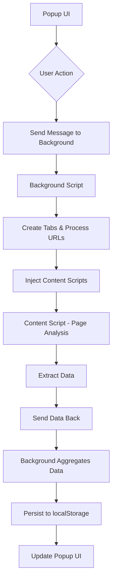

# Trustpilot Data Scraper

A Chrome extension for scraping business data from Trustpilot categories and business review pages.

## Table of Contents
- [Overview](#overview)
- [Technologies Used](#technologies-used)
- [Architecture](#architecture)
- [How It Works](#how-it-works)
- [Project Complexity](#project-complexity)
- [Code Interaction](#code-interaction)
- [Installation](#installation)
- [Usage](#usage)
- [Features](#features)
- [Data Collection](#data-collection)
- [File Structure](#file-structure)
- [Troubleshooting](#troubleshooting)

## Overview

The Trustpilot Data Scraper is a Chrome extension designed to extract valuable business information from Trustpilot's website. It systematically navigates through category pages, collects business URLs, visits each business page, and extracts key data points such as business categories and contact emails. The extension handles pagination automatically, allowing for comprehensive data collection across multiple pages.

## Technologies Used

### Core Technologies
- **Chrome Extension Manifest V3**: Utilizes the latest Chrome extension architecture for enhanced security and performance
- **JavaScript (ES6+)**: Core programming language for all extension components
- **HTML5/CSS3**: For the popup user interface
- **Chrome APIs**: Leveraging scripting, tabs, storage, and downloads APIs

### Why These Technologies?
1. **Manifest V3**: Provides better security, performance, and compliance with Chrome's evolving standards
2. **Native Chrome APIs**: Direct integration with browser functionality eliminates external dependencies
3. **JavaScript**: Universal language with native support in browsers, enabling seamless DOM manipulation
4. **HTML/CSS**: Lightweight UI components without framework overhead

## Architecture

The extension follows a modular architecture with three primary components:

### 1. Manifest File (`manifest.json`)
Central configuration defining permissions, entry points, and metadata.

### 2. Background Script (`background.js`)
Service worker handling core logic, data coordination, and batch processing.

### 3. Content Script (`content.js`)
Executes in the context of Trustpilot pages for DOM manipulation and data extraction.

### 4. Popup Interface (`popup.html`, `popup.js`)
User-facing component for initiating scrapes, viewing data, and managing exports.

## How It Works

### Step-by-Step Process

1. **Initialization**: User navigates to a Trustpilot categories page and opens the extension popup

2. **URL Collection**: 
   - User clicks "Scrape Business Data"
   - Content script identifies all business links on the current page
   - URLs are sent to the background script for processing

3. **Batch Processing**:
   - Background script creates hidden tabs for each business URL
   - Tabs load asynchronously for efficient processing
   - Waits for each tab to reach a "complete" loading state

4. **Data Extraction**:
   - Content script runs on each business page
   - Extracts business category from breadcrumbs
   - Extracts contact email from business information section
   - Sends extracted data back to background script

5. **Pagination Handling**:
   - After processing all businesses on current page, simulates "Next" button click
   - Automatically continues to subsequent pages
   - Stops when no more pages are available

6. **Data Management**:
   - Aggregates collected data in background script
   - Stores data persistently using localStorage
   - Provides download functionality for JSON export

## Project Complexity

### Technical Challenges

1. **Asynchronous Tab Management**: Coordinating multiple browser tabs simultaneously while ensuring proper lifecycle management

2. **Dynamic Content Handling**: Dealing with JavaScript-rendered content and ensuring elements are available before interaction

3. **Cross-Component Communication**: Managing message passing between popup, background, and content scripts

4. **Error Handling**: Robust error handling for network issues, missing elements, and tab management failures

5. **Memory Management**: Efficiently handling potentially large datasets without browser performance degradation

### Unique Features

1. **Automatic Pagination**: Seamless navigation through multiple pages without user intervention
2. **Batch Processing**: Concurrent processing of multiple business pages for improved performance
3. **Persistent Storage**: Data retention across browser sessions using localStorage
4. **Real-time Progress Tracking**: Live updates on scraping progress
5. **Secure Data Export**: Direct download functionality without external dependencies

## Code Interaction

### Message Flow



### Component Responsibilities

#### Popup (`popup.js`)
- Handles user interactions
- Initiates scraping process
- Manages UI updates
- Controls data export functionality
- Communicates with background script

#### Background Script (`background.js`)
- Orchestrates batch processing
- Manages tab creation and cleanup
- Aggregates collected data
- Handles pagination logic
- Coordinates content script execution

#### Content Script (`content.js`)
- Detects page type (category vs business)
- Extracts data from business pages
- Simulates user interactions (next button clicks)
- Communicates with background script

## Installation

### Prerequisites
- Google Chrome browser (version 88 or higher)
- Access to Trustpilot website

### Installation Steps

1. **Clone or Download**:
   ```bash
   git clone https://github.com/your-repo/Trustpilot-Data-Scrapper.git
   ```
   Or download the ZIP file and extract it.

2. **Open Chrome Extensions**:
   - Open Google Chrome
   - Navigate to `chrome://extensions/`

3. **Enable Developer Mode**:
   - Toggle "Developer mode" in the top right corner

4. **Load the Extension**:
   - Click "Load unpacked"
   - Select the `Trustpilot-Data-Scrapper-development` folder

5. **Verify Installation**:
   - The Trustpilot Scraper icon should appear in your Chrome toolbar

## Usage

### Basic Operation

1. **Navigate to Trustpilot**:
   - Go to a Trustpilot categories page (e.g., `https://www.trustpilot.com/categories`)

2. **Open the Extension**:
   - Click the Trustpilot Scraper icon in your Chrome toolbar

3. **Start Scraping**:
   - Click the "Scrape Business Data" button
   - The extension will automatically:
     - Collect all business URLs on the current page
     - Visit each business page
     - Extract category and email information
     - Navigate to the next page
     - Repeat until all pages are processed

4. **View Collected Data**:
   - Processed data appears in the popup window
   - Data persists across browser sessions

5. **Export Data**:
   - Click "Download Data" to save as JSON
   - Click "Clear Data" to reset and start fresh

### Advanced Features

#### Persistent Storage
- Data is automatically saved to localStorage
- Survives browser restarts
- Accumulates across multiple scraping sessions

#### Real-time Feedback
- Progress updates appear in the popup during scraping
- Detailed logs show processing status
- Error messages for troubleshooting

## Features

### Current Capabilities
- Automated business data extraction from Trustpilot
- Multi-page pagination handling
- Concurrent processing for improved performance
- JSON data export functionality
- Persistent data storage
- Real-time progress tracking
- Responsive UI with visual feedback

### Data Points Collected
- Business categories from breadcrumb navigation
- Contact emails from business information sections
- Automatic pagination through result sets

## Data Collection

### Data Structure
The extension collects structured data in the following format:
```json
{
  "categories": ["Category Name"],
  "email": "contact@example.com"
}
```

### Data Sources
1. **Categories**: Extracted from breadcrumb navigation on business pages
2. **Emails**: Retrieved from contact information sections using mailto links

### Data Quality
- Handles missing data gracefully with "N/A" placeholders
- Validates element existence before extraction
- Maintains data integrity through structured collection

## File Structure

```
Trustpilot-Data-Scrapper/
├── manifest.json          # Extension configuration
├── background.js          # Core processing logic
├── content.js             # Page-specific scripts
├── popup.html             # User interface markup
├── popup.js               # Popup functionality
├── images/
│   └── logo-white-cropped (1).svg  # Extension icon
└── README.md              # This documentation
```

## Troubleshooting

### Common Issues

#### No Data Collected
- Ensure you're on a Trustpilot categories page
- Check that the extension has necessary permissions
- Verify Trustpilot content hasn't changed structure

#### Extension Not Responding
- Refresh the Trustpilot page
- Reload the extension in `chrome://extensions/`
- Check browser console for error messages

#### Download Not Working
- Ensure Chrome downloads are enabled
- Check if download was blocked by browser security
- Verify data exists before attempting download

### Debugging Steps

1. **Check Console Logs**:
   - Right-click extension icon → Inspect popup
   - View background script console in `chrome://extensions/`

2. **Verify Permissions**:
   - Confirm all required permissions are granted
   - Check site access permissions for Trustpilot

3. **Test Components Individually**:
   - Validate content script execution on Trustpilot pages
   - Test message passing between components
   - Confirm data extraction selectors work

### Browser Compatibility
- Designed for Google Chrome (Manifest V3)
- Requires Chrome version 88 or higher
- May require adjustments for other Chromium browsers

## Limitations

1. **Rate Limiting**: Heavy usage may trigger website rate limiting
2. **Structure Dependency**: Relies on specific Trustpilot page structures
3. **Network Dependent**: Requires stable internet connection
4. **Single Site**: Specifically designed for Trustpilot only

## Future Enhancements

Potential improvements could include:
- Support for additional data points
- Export to CSV/Excel formats
- Customizable scraping parameters
- Enhanced error recovery
- Progress saving for large datasets
